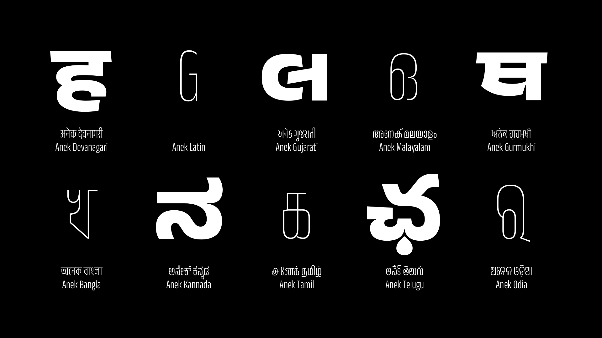

Anek Font Family by Ek Type
===========================

Anek, as the meaning of the word suggests, is an exercise in multiplicity — multiple scripts designed in multiple weights and widths by multiple designers. Embracing the variable font technology, Anek meets the demands of the modern multiscript page with its confident and contemporary design.

Its expansive design space allows Anek to don multiple personalities. At its most condensed, capsular forms keep structures compact for that graphic texture. On the wide end of the spectrum, the extra legroom lets each letter yawn and stretch into their message. But it is in the boldest weights that Anek comes alive. Sharp terminals and tapered joineries sparkle amidst regimented forms, making this ideal for setting titillating headlines or that magnetic word-mark.

While the extreme styles wear their style on their sleeve, the middling widths and weights mean business. When in the presence of other styles, they recede into the back, allowing the extremes to shine. But left on their own, they set text with a quiet confidence. The quirks are but a faint echo that no longer distract; clarity over personality.

Anek comes in ten scripts: Bangla, Devanagari, Kannada, Latin, Gujarati, Gurmukhi, Malayalam, Odia, Tamil and Telugu. The design of each script borrows from its own typographic culture and reflects the perspectives of their designers. Yet they cohabit the page in visual harmony. Each script is equipped with multiple variations, thus allowing the page to be lavished with a finely tuned typographic hierarchy.

This project is collaboratively designed, engineered and maintained by Ek Type, a collective of type designers based in Mumbai focused on designing contemporary Indian typefaces. Contributors of this project are: Maithili Shingre (Anek Malayalam, Anek Kannada), Yesha Goshar (Anek Latin, Anek Odia), Kailash Malviya (Anek Devanagari), Aadarsh Rajan (Anek Tamil), Sulekha Rajkumar (Anek Bangla), Vaishnavi Murthy (Anek Kannada), Omkar Bhoir (Anek Telugu), Mrunmayee Ghaisas (Anek Gujarati), Mahesh Sahu (Anek Odia), and Sarang Kulkarni (Anek Gurmukhi). Project management and design assistance by Noopur Datye; and Font engineering and type design assistance by Girish Dalvi.

License
-------
Anek is licensed under the SIL Open Font License v1.1 (<http://scripts.sil.org/OFL>). To view the copyright and specific terms and conditions, please refer to [OFL.txt](OFL.txt)

### Downloading the font files (TTF files)

The font files can be downloaded from the [releases page.](https://github.com/EkType/Anek/releases)

### Building the font from source
Seven scripts have been designed in Glyphs and three scripts have been designed in Fontlab 7. Since there are two types of source files, we use UFO's and a unified build script to build our fonts. This build script (`build.sh`) is provided in the `sources` folder. Download the sources, and use this script to build the fonts from within the repo’s root folder.  
> `fontmake` and `gftools` are required for building the fonts from UFO's. 

If you need to re-generate the UFO's or study the source files; the Glyphs and Fontlab source files are available in the sources folder under the respective script directories.

> Characters change shape according to weight/width axis. The code for this has been written in the `designspace` file for each script. If you regenerate the UFO's, please include the designspace code when you build your fonts.

### Getting Involved

Would you like to contribute to the development of this font family? Here is how you can help:

1. Tell us about any bugs you find, or enhancements you would like to see. Write to `info@ektype.in` if you require any assistance in contributing to the family.

2. Contribute directly to the fonts. In this repository, we provide the complete set of source files that we use ourselves to develop the fonts. If you wish to contribute directly, please see below how we build the fonts and follow our build process so that we can easily include your contribution, and follow the GitHub pull request process to send your contribution.

### Bug Reports

Send us bug reports, feature enhancements or glyph requests, using the [GitHub Issue Tracker](https://github.com/EkType/Anek/issues/).